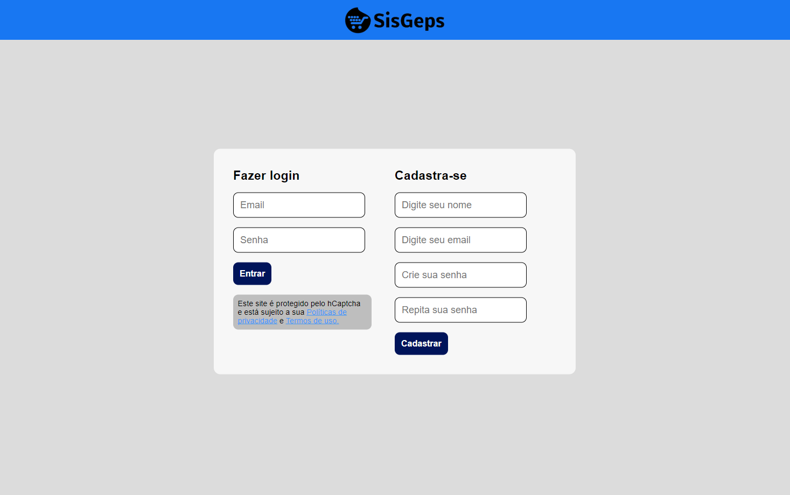
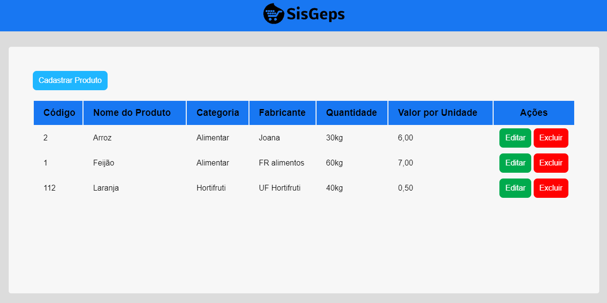
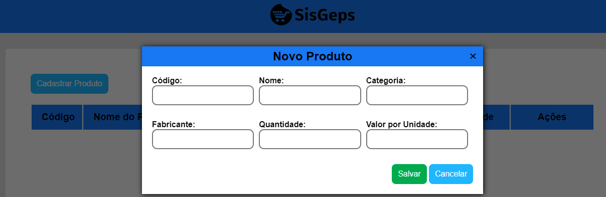

    

<h1 align="center"> Sistema de Gerenciamento de Estoque para Supermercado</h1>

<h2> 
&#128187 Equipe de Desenvolvimento:
 </h2> 

<table>
    <tr>
        <td>
            

                
                
DIOGO GABRIEL / 2022011185
                
                <a href="https://www.linkedin.com/in/diogogabriel-developer/" target="_blank">LinkedIn</a> -
                <a href="https://github.com/DiogoG-dev" target="_blank">GitHub</a>
            

        </td>
        <td>
            

                
                
JOSÉ KAYO / 2022012638

                <a href="https://www.linkedin.com/in/kayosilva/" target="_blank">LinkedIn</a> -
                <a href="https://github.com/kayopro" target="_blank">GitHub</a>
            

        </td>
        <td>
            

                
                
MATHEUS FAUSE / 2022011775

                <a href="https://www.linkedin.com/in/matheus-jacome-lino/" target="_blank">LinkedIn</a> -
                <a href="https://github.com/mfjacome" target="_blank">GitHub</a>
            

        </td>
    </tr>
</table>

 
<h2>Descrição</h2>

Este é um MVP web em sua versão inicial, ele apresenta funcionalidades essenciais para atender às necessidades básicas dos usuários com o objetivo de automatizar e organizar os processos relacionados ao controle de estoque, compra e venda de produtos em um supermercado de bairro.

 O presente Sistema de Gerenciamento de Estoque de Produtos de um Supermercado de Bairro foi idealizado como sendo uma solução para organizar, automatizar e aprimorar os processos relacionados ao controle de estoque, compra e venda de produtos em pequenos supermercados de bairro. 

 Nessa perspectiva, esta documentação será um facilitador para a construção, desenvolvimento e manutenção do sistema. Além disso, esse artefato nos fornece uma comunicação eficaz entre os membros da equipe e demais partes interessadas no projeto. 
  

<h2>Páginas</h2>
A seguir apresentaremos as telas do SisGeps:
<h3>Tela de Login</h3>
<section>
      <ul>
        <li>Esta tela tem o objetivo de efetuar o cadastro do usuário e possibilitar o acesso ao sistema.</li>        
      </ul>
    </section>    

 
<h3>Tela da Lista de Produtos</h3>
<section>
      <ul>
        <li>Esta tela tem a função de Cadastrar, Editar e Excluir produtos. </li>        
      </ul>
    </section>    
 

<h3>Tela de Cadastro de Produtos</h3>
<section>
      <ul>
        <li>Esta tela tem a função de Cadastrar um novo produto no sistema</li>        
      </ul>
    </section>    
 

<h2> 
&#128204 Funcionalidades do projeto:
 </h2>

- `Funcionalidade 1`: Cadastrar usuários;
- `Funcionalidade 2`: Efetuar Login;
- `Funcionalidade 3`: Cadastrar produtos;
- `Funcionalidade 4`: Editar produtos cadastrados;
- `Funcionalidade 5`: Excluir produtos;

 
<h2>Uso</h2>

 
<h2>Requisitos</h2>

 
<h2>Tecnologias Utilizadas</h2>

 
<h2>Contribuições</h2>
Contribuições são bem-vindas!

 
<h2>Considerações Finais</h2>

Por meio do desenvolvimento desse trabalho, conseguimos adquirir valiosas experiências que serão de grande auxílio em projetos futuros. O Desenvolvimento deste MVP Web não apenas resultou em uma solução robusta e intuitiva para o Sistema de Gerenciamento de Estoque para Supermercado (SisGeps), mas também enriqueceu nosso conhecimento, contribuindo para um aprimoramento contínuo em futuras empreitadas.

